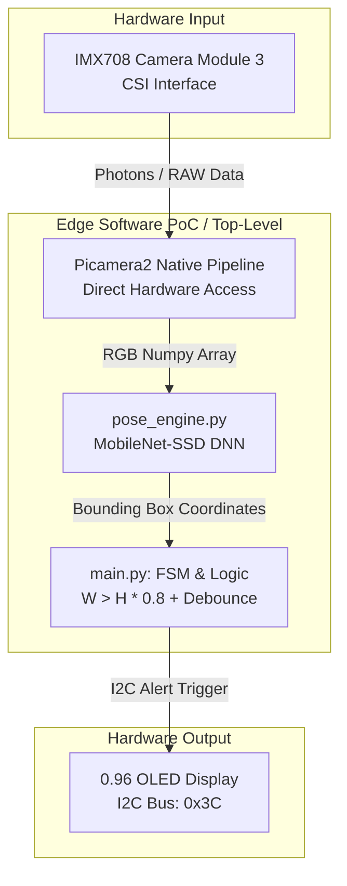

# Edge AI Fall Detection System: Hardware vs. Software PoC

## 📌 Project Overview
This project is a Proof of Concept (PoC) for an Edge Computing based fall-detection system, developed as a mini-project for the **Embedded Electronic Systems (130344)** course. 

It serves as a software-centric comparative counterpart to our primary senior design project, which implements the same logic utilizing custom RTL, BRAM, and bare-metal SCCB/VGA controllers on an Artix-7 FPGA (Nexys A7 100T). Here, we evaluate the development agility and performance of utilizing a microcomputer running an OS with pre-trained AI models.

## 🏗️ System Architecture & Data Flow

The system is designed with a top-down modular approach, separating hardware interfacing from the software logic.

* **Input (Hardware):** Raspberry Pi Camera Module 3 (CSI Interface).
* **Processing (Software):** Raspberry Pi 3 running a Python loop.
    * Computer Vision & AI: OpenCV DNN with pre-trained MobileNet-SSD (Object Detection).
    * Detection Logic: Geometric bounding box aspect ratio analysis ($Width > Height \times 0.8$).
* **Output (Hardware):** I2C-based 0.96" OLED Display (SSD1306).

## ⚖️ FPGA vs. Python Implementation Comparison
To ensure alignment with the Artix-7 VHDL project, the following architectural mapping is maintained:

| Component (Python) | FPGA Equivalent (VHDL) | Engineering Role |
| :--- | :--- | :--- |
| **`main.py`** | **`fall_detection_top.vhd`** | Logic Control (FSM), Routing, Debounce Filter & Graceful Shutdown |
| **`Picamera2` (Native)**| **`OV7670_Controller.vhd`** | Data Acquisition (Direct Hardware Pipeline) |
| **`pose_engine.py`** | **`Deep_Learning_IP.vhd`** | AI Object Detection & Feature Extraction |
| **`i2c_display.py`** | **`I2C_OLED_Controller.vhd`** | External Hardware Communication (I/O) |
| **`while True` Loop** | **System Clock / FSM logic**| Sampling & Synchronization |

## 🗂️ Repository Structure
* `main.py`: The central execution loop (Software equivalent to the FPGA Top-Level). Includes native camera initialization, temporal noise filtering (Debounce), and system integration.
* `pose_engine.py`: AI object detection and bounding box extraction.
* `i2c_display.py`: Hardware abstraction layer (HAL) for the external screen.
* `requirements.txt`: Python package dependencies.
* `docs/`: Contains project proposal, draw.io diagrams, and the IEEE paper draft.

## 🔌 Hardware Pinout & Connections
| Component | RPi 3 Interface | Notes |
| :--- | :--- | :--- |
| Camera Module 3 | CSI Port | Located between HDMI and Audio Jack. Requires native `libcamera` access. |
| 0.96" OLED (SSD1306) | GPIO 2 (SDA), GPIO 3 (SCL) | VCC to 3.3V (Pin 1), GND to Ground (Pin 6). I2C Address: `0x3C`. |

## 💡 Key Engineering Insights (FPGA vs. Software PoC)
1. **Resource Management:** Instead of writing RTL modules for spatial downsampling and BRAM management (as in FPGA), the PoC leverages OpenCV's DNN module to automatically scale input frames into optimized low-resolution blobs for the MobileNet-SSD model, significantly reducing CPU load.
2. **Noise Filtering (Debounce):** The VHDL FSM uses a clock-cycle counter to prevent false positives from glitchy frames. In our Python implementation, this logic is identically replicated in `main.py` using a frame-counter threshold (`consecutive_falls >= 2`), achieving the same hysteresis effect in software.
3. **Hardware-Level Data Pipelines:** Bypassing high-level OS abstractions (like V4L2 in OpenCV) in favor of direct sensor access (`Picamera2`) was mandatory to eliminate pipeline timeouts and achieve stable real-time data streaming without crashing the local FSM.

## 🚀 Development Roadmap (Milestones)
- [x] **Phase 0:** Project initialization, GitHub repository, and LaTeX skeleton.
- [x] **Phase 1:** Software architecture, basic FSM logic, and HAL implementation.
- [x] **Phase 2:** AI Software Integration (MobileNet-SSD bounding box geometry) and Top-Level Debounce implementation.
- [x] **Phase 3:** Hardware Setup: Enable OS CSI port, install dependencies (`requirements.txt`), and validate physical camera/I2C connections.
- [x] **Phase 4:** Live Validation: Successful integration of native `Picamera2` pipeline, achieving stable live inference and geometric bounding box evaluation.
- [x] **Phase 5:** Hardware Output: Physical I2C Display wiring, logic integration, and Graceful Shutdown implementation.
- [x] **Phase 6:** Final system validation and IEEE documentation update.
